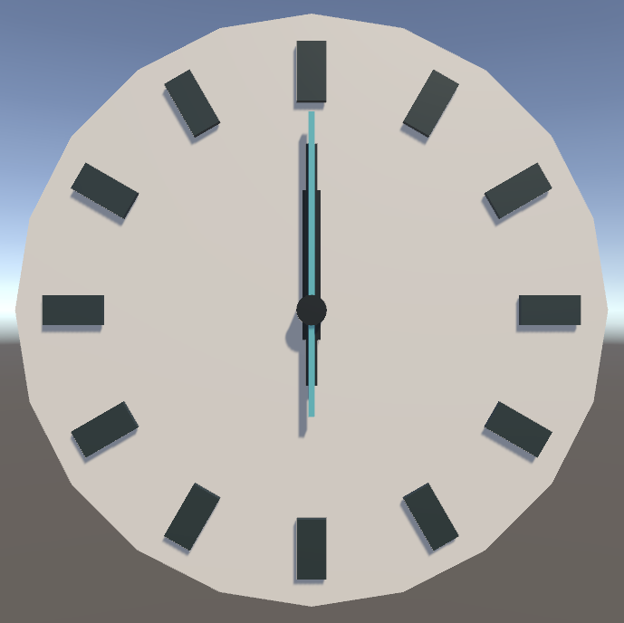

# 3D-Clock

   

## About
3D clock with animated clock arms that shows the time. Project by [Catlike Coding's tutorial](https://catlikecoding.com/unity/tutorials/basics/game-objects-and-scripts/).

## Screenshots

  
  

## Developers
🙋‍♀️ [Anastasiia Radaeva](https://github.com/AnastasiiaRadaeva)
